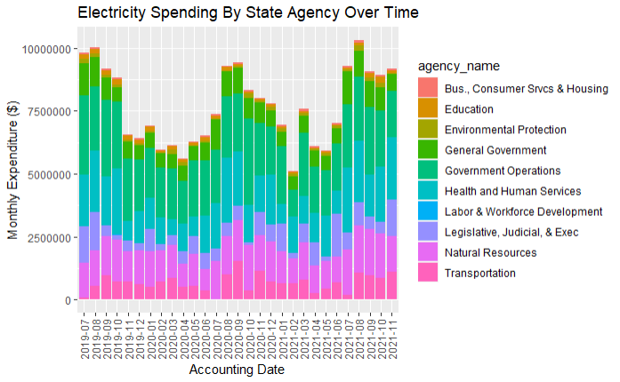

API\_Examples
================

This document contains embedded R code that demonstrates how to access
the demo Open FI$Cal API, located at <https://catalog.ogopendata.com/>.

The .Rmd version of this document can be knit within RStudio to produce
the .md version of this document (both included in this repo).

See also the documentation for the [CKAN
API](https://docs.ckan.org/en/ckan-2.7.3/api/) and the [CKAN Datastore
API](https://docs.ckan.org/en/ckan-2.7.3/maintaining/datastore.html#the-datastore-api).

## Load Necessary Packages

If you don’t have these packages installed, install them with
`install.packages("packagename")`.

``` r
library("tidyverse") #a set of packages that make working in R more efficient
library("httr") #tools for working with URLs
library("jsonlite") #JSON parser and generator
library("data.table") #more efficient extention of R's base data.frames
```

## Get Resource IDs

This script uses the CKAN API to get all the information about the
`california-expenditure-data` package (i.e. dataset) and extract the IDs
for each of the resources that can be searched with the datastore API.
For this particular dataset, there is one resource (i.e. file) for each
month of data.

This is an important step, as the resulting list of resource IDs will
allow future scripts to loop through all of the resources to get
information on all
months.

``` r
pkg_show <- GET("https://catalog.ogopendata.com/api/3/action/package_show?id=california-expenditure-data") #gets info on the "california-expenditure-data" package
pkg_show_text <- content(pkg_show, "text") #extracts the text content
pkg_show_JSON <- fromJSON(pkg_show_text, flatten = T) #turns the JSON response into a usable format
pkg_show_resources <- pkg_show_JSON$result$resources #extracts just the results$resources table from the response
resource_ids <- pkg_show_resources$id[which(pkg_show_resources$datastore_active)] #creates a vector of just the resource IDs that have indexed, searchable data (are "datastore active") - WILL BE USED LATER
resource_ids
```

    ##  [1] "cc491680-1eb0-42d2-8dac-47a2f1204d3e"
    ##  [2] "3e5b9f4e-c1dc-4752-bb38-096d480ca3f1"
    ##  [3] "02129231-0d2e-4028-a955-eb35f6123c3e"
    ##  [4] "3dc2cfff-0d33-412f-ba6e-d930958db3b7"
    ##  [5] "0f261581-45ab-413d-bc05-d7571e73ba8b"
    ##  [6] "006d1601-7f99-413f-8c85-56b0249fba56"
    ##  [7] "7721a8fc-b11d-4519-8900-01fc46ecde4e"
    ##  [8] "463e0f15-8323-4646-a40b-d3f1e09f8a3b"
    ##  [9] "7cae147c-eb1f-47c2-a5d7-19aaf209ef1a"
    ## [10] "6b7faa97-617f-4941-a50d-a50d08d159bf"
    ## [11] "a17294a6-f6de-4c7d-bc96-c5ae7b488573"
    ## [12] "58349034-2ce5-4a57-a906-dc8b2d8445a4"
    ## [13] "c007b59b-98a9-414d-9d51-f731b2dce40a"
    ## [14] "5856a023-028a-4a46-8a4d-cb805d2b6612"
    ## [15] "c66981f2-00b6-42b0-b84e-14e6d6875564"
    ## [16] "4b423f30-9e5e-4267-a757-fca8f83663d8"
    ## [17] "956673b9-a57b-46c6-821e-e531e793941d"
    ## [18] "abb4be52-71c1-4821-8523-fb1002f80059"
    ## [19] "622d77f6-c76d-4d86-85b5-6f2df7207afc"
    ## [20] "4bad31b4-a3bb-4d15-b48f-25d5ac9be5fb"
    ## [21] "d83fd7e3-bb77-460e-b19e-e7aea272a9d2"
    ## [22] "f87e4cab-d6e8-4828-9dec-fe24516f4e1e"
    ## [23] "ee9200a5-6a2d-42a1-a362-f421535248f6"
    ## [24] "751ad5ed-c7d7-4bf0-83bd-991bda009a0a"
    ## [25] "d7e40b35-cb38-41c6-ae89-95ac6abc9bd7"
    ## [26] "6552bff8-77ab-4a85-9c85-abc83cc58a60"
    ## [27] "9935b6f1-b149-4818-8a53-3aa30f61387e"
    ## [28] "f8694b36-0c0c-4e6d-a9de-37c391624c19"
    ## [29] "e1571a71-feb6-4889-967c-ea48bc4352c6"
    ## [30] "4994566a-343a-40c7-9559-6668a75a710e"
    ## [31] "8371424b-80b9-4aa0-a415-7e35c6f55711"
    ## [32] "ab63442b-321f-4485-a3ac-cb1219b94182"
    ## [33] "965b9335-8287-465b-a52d-26d9f2c2dbb8"
    ## [34] "cc26d54a-a977-40bb-92c0-2ef771d6ed77"
    ## [35] "1a86af08-1811-4ae0-ae69-d8aac73084dd"
    ## [36] "72c4ae60-a7f5-47aa-915e-35492334b9d6"
    ## [37] "67a44a91-7c34-4e3c-b0c7-fb5def1c1f08"
    ## [38] "2f30b2e1-7190-4c9f-981c-ca7cb420b9a2"
    ## [39] "27e17e21-356e-483d-8215-b419c164869a"
    ## [40] "63ad9d07-2d4d-464d-ac3d-7e93e60717f3"
    ## [41] "93d10c09-7a55-4fa4-b0a4-5df1e6e5541a"

## Code Demos Using One Resource

### Get the first 5 rows of data, skipping the first, from a specific resource.

NOTE: On this demo server, this request sometimes results in a server
error. If this happens, choose a different resource, paste it into the
appropriate place in the URL, and try
again.

``` r
five_rows <- GET("https://catalog.ogopendata.com/datastore/odata3.0/006d1601-7f99-413f-8c85-56b0249fba56?$top=5&$skip=1&$format=json")
five_rows_text <- content(five_rows, "text")
five_rows_JSON <- fromJSON(five_rows_text, flatten = T)
five_rows_JSON
```

    ## $odata.metadata
    ## [1] "FIXME"
    ## 
    ## $value
    ##         Account Category Budget Reference Sub-Category Accounting Period
    ## 1                 Travel                    Budget Act                12
    ## 2 Other Items of Expense                    Budget Act                12
    ## 3              Utilities                    Budget Act                12
    ## 4              Utilities                    Budget Act                12
    ## 5              Utilities                    Budget Act                12
    ##              Account Description Business Unit       Agency Name
    ## 1 Travel - In State -Private Car          3790 Natural Resources
    ## 2 Chemica/Drugs/Medic & Lab Supp          3790 Natural Resources
    ## 3                    Electricity          3790 Natural Resources
    ## 4                    Electricity          3790 Natural Resources
    ## 5                    Electricity          3790 Natural Resources
    ##   Related Document                  Account Type Year of Enactment
    ## 1               NA Operating Expense & Equipment              2018
    ## 2               NA Operating Expense & Equipment              2018
    ## 3               NA Operating Expense & Equipment              2018
    ## 4               NA Operating Expense & Equipment              2018
    ## 5               NA Operating Expense & Equipment              2018
    ##   Budget Reference Category Budget Reference Sub-Program Description
    ## 1          State Operations              001        Clearing Account
    ## 2          State Operations              001        Clearing Account
    ## 3          State Operations              001        Clearing Account
    ## 4          State Operations              001        Clearing Account
    ## 5          State Operations              001        Clearing Account
    ##   Accounting Date   Account Sub-Category Fiscal Year Begin Account
    ## 1      2019-06-12        In-State Travel              2018 5320440
    ## 2      2019-06-14 Other Items of Expense              2018 5390100
    ## 3      2019-06-19              Utilities              2018 5326100
    ## 4      2019-06-19              Utilities              2018 5326100
    ## 5      2019-06-27              Utilities              2018 5326100
    ##                  Document ID            Department Name Program Description
    ## 1 3790.00141370.0.00001.0002 Dept of Parks & Recreation    Clearing Account
    ## 2 3790.00141557.0.00001.0001 Dept of Parks & Recreation    Clearing Account
    ## 3 3790.00141992.0.00001.0001 Dept of Parks & Recreation    Clearing Account
    ## 4 3790.00141975.0.00001.0001 Dept of Parks & Recreation    Clearing Account
    ## 5 3790.00143367.0.00001.0001 Dept of Parks & Recreation    Clearing Account
    ##     Budget Reference Description               Fund Description Monetary Amount
    ## 1 BA State Operations-Support001 State Parks And Recreation Fun          250.56
    ## 2 BA State Operations-Support001 State Parks And Recreation Fun            99.1
    ## 3 BA State Operations-Support001 State Parks And Recreation Fun           19.34
    ## 4 BA State Operations-Support001 State Parks And Recreation Fun          173.96
    ## 5 BA State Operations-Support001 State Parks And Recreation Fun          188.58
    ##   Program Code    Fund Group                 Vendor Name _id Fund Code
    ## 1      9999000 Special Funds                Confidential   2      0392
    ## 2      9999000 Special Funds                     US BANK   3      0392
    ## 3      9999000 Special Funds TURLOCK IRRIGATION DISTRICT   4      0392
    ## 4      9999000 Special Funds TURLOCK IRRIGATION DISTRICT   5      0392
    ## 5      9999000 Special Funds   PACIFIC GAS & ELECTRIC CO   6      0392

### Use SQL to get all vendors like `%HARLEY%` from a specific resource.

``` r
harley <- GET("https://catalog.ogopendata.com/api/3/action/datastore_search_sql?sql=SELECT%20*%20from%20%220f261581-45ab-413d-bc05-d7571e73ba8b%22%20WHERE%20%22Vendor%20Name%22%20LIKE%20%27%HARLEY%%27")
harley_text <- content(harley, "text")
harley_JSON <- fromJSON(harley_text, flatten = T)
harley_records <- harley_JSON$result$records
harley_records <- harley_records[ , -24] #remove "_full_text" field for easier display
head(harley_records)
```

    ##         Account Category Budget Reference Sub-Category Accounting Period
    ## 1 Other Items of Expense                    Budget Act                 1
    ## 2 Other Items of Expense                    Budget Act                 1
    ## 3 Other Items of Expense                    Budget Act                 1
    ## 4 Other Items of Expense                    Budget Act                 1
    ## 5 Other Items of Expense                    Budget Act                 1
    ## 6 Other Items of Expense                    Budget Act                 1
    ##              Account Description Business Unit    Agency Name Related Document
    ## 1 Vehicle Maintena & Repair Svcs          2720 Transportation               NA
    ## 2 Other Items of Expense - Goods          2720 Transportation               NA
    ## 3 Other Items of Expense - Goods          2720 Transportation               NA
    ## 4 Other Items of Expense - Goods          2720 Transportation               NA
    ## 5 Other Items of Expense - Goods          2720 Transportation               NA
    ## 6 Other Items of Expense - Goods          2720 Transportation               NA
    ##                    Account Type Year of Enactment Budget Reference Category
    ## 1 Operating Expense & Equipment              2018          State Operations
    ## 2 Operating Expense & Equipment              2018          State Operations
    ## 3 Operating Expense & Equipment              2018          State Operations
    ## 4 Operating Expense & Equipment              2018          State Operations
    ## 5 Operating Expense & Equipment              2018          State Operations
    ## 6 Operating Expense & Equipment              2018          State Operations
    ##   Budget Reference Sub-Program Description Accounting Date
    ## 1              001        Clearing Account      2019-07-18
    ## 2              001        Clearing Account      2019-07-26
    ## 3              001        Clearing Account      2019-07-26
    ## 4              001        Clearing Account      2019-07-26
    ## 5              001        Clearing Account      2019-07-26
    ## 6              001        Clearing Account      2019-07-26
    ##            Account Sub-Category Fiscal Year Begin Account
    ## 1 Vehicle Ops excl Insur & Depr              2019 5390850
    ## 2        Other Items of Expense              2019 5390880
    ## 3        Other Items of Expense              2019 5390880
    ## 4        Other Items of Expense              2019 5390880
    ## 5        Other Items of Expense              2019 5390880
    ## 6        Other Items of Expense              2019 5390880
    ##                  Document ID               Department Name Program Description
    ## 1 2720.00096997.0.00001.0001 Dept of the CA Highway Patrol    Clearing Account
    ## 2 2720.00098985.0.00001.0001 Dept of the CA Highway Patrol    Clearing Account
    ## 3 2720.00098985.0.00003.0001 Dept of the CA Highway Patrol    Clearing Account
    ## 4 2720.00099036.0.00001.0001 Dept of the CA Highway Patrol    Clearing Account
    ## 5 2720.00099036.0.00003.0001 Dept of the CA Highway Patrol    Clearing Account
    ## 6 2720.00099036.0.00004.0001 Dept of the CA Highway Patrol    Clearing Account
    ##     Budget Reference Description           Fund Description Monetary Amount
    ## 1 BA State Operations-Support001 Motor Vehicle Account, Stf            72.5
    ## 2 BA State Operations-Support001 Motor Vehicle Account, Stf          338.98
    ## 3 BA State Operations-Support001 Motor Vehicle Account, Stf            5.45
    ## 4 BA State Operations-Support001 Motor Vehicle Account, Stf            5.53
    ## 5 BA State Operations-Support001 Motor Vehicle Account, Stf           17.67
    ## 6 BA State Operations-Support001 Motor Vehicle Account, Stf           31.17
    ##   Program Code    Fund Group                   Vendor Name   _id Fund Code
    ## 1      9999000 Special Funds      EL CAJON HARLEY-DAVIDSON 22207      0044
    ## 2      9999000 Special Funds POMONA VALLEY HARLEY-DAVIDSON 28492      0044
    ## 3      9999000 Special Funds POMONA VALLEY HARLEY-DAVIDSON 28493      0044
    ## 4      9999000 Special Funds POMONA VALLEY HARLEY-DAVIDSON 28494      0044
    ## 5      9999000 Special Funds POMONA VALLEY HARLEY-DAVIDSON 28495      0044
    ## 6      9999000 Special Funds POMONA VALLEY HARLEY-DAVIDSON 28496      0044

### Use SQL to get all business units like `2720` from a specific resource.

Each department has a four-digit business unit code. 2720 is the
California Highway
Patrol.

``` r
test_dept <- GET("https://catalog.ogopendata.com/api/3/action/datastore_search_sql?sql=SELECT%20*%20from%20%22cc491680-1eb0-42d2-8dac-47a2f1204d3e%22%20WHERE%20%22Business%20Unit%22%20LIKE%20%272720%27")
test_dept_text <- content(test_dept, "text")
test_dept_JSON <- fromJSON(test_dept_text, flatten = T)
test_dept_records <- test_dept_JSON$result$records
test_dept_records <- test_dept_records[ , -24]
head(test_dept_records)
```

    ##         Account Category Budget Reference Sub-Category Accounting Period
    ## 1 Other Items of Expense                    Budget Act                 5
    ## 2 Other Items of Expense                    Budget Act                 5
    ## 3 Other Items of Expense                    Budget Act                 5
    ## 4 Other Items of Expense                    Budget Act                 5
    ## 5 Other Items of Expense                    Budget Act                 5
    ## 6 Other Items of Expense                    Budget Act                 5
    ##              Account Description Business Unit    Agency Name Related Document
    ## 1 Vehicle Maintena & Repair Svcs          2720 Transportation               NA
    ## 2 Other Items of Expense - Goods          2720 Transportation               NA
    ## 3 Vehicle Maintena & Repair Svcs          2720 Transportation               NA
    ## 4 Vehicle Maintena & Repair Svcs          2720 Transportation               NA
    ## 5 Vehicle Maintena & Repair Svcs          2720 Transportation               NA
    ## 6 Vehicle Maintena & Repair Svcs          2720 Transportation               NA
    ##                    Account Type Year of Enactment Budget Reference Category
    ## 1 Operating Expense & Equipment              2019          State Operations
    ## 2 Operating Expense & Equipment              2019          State Operations
    ## 3 Operating Expense & Equipment              2019          State Operations
    ## 4 Operating Expense & Equipment              2019          State Operations
    ## 5 Operating Expense & Equipment              2019          State Operations
    ## 6 Operating Expense & Equipment              2019          State Operations
    ##   Budget Reference Sub-Program Description Accounting Date
    ## 1              001        Clearing Account      2019-11-07
    ## 2              001        Clearing Account      2019-11-07
    ## 3              001        Clearing Account      2019-11-07
    ## 4              001        Clearing Account      2019-11-07
    ## 5              001        Clearing Account      2019-11-07
    ## 6              001        Clearing Account      2019-11-07
    ##            Account Sub-Category Fiscal Year Begin Account
    ## 1 Vehicle Ops excl Insur & Depr              2019 5390850
    ## 2        Other Items of Expense              2019 5390880
    ## 3 Vehicle Ops excl Insur & Depr              2019 5390850
    ## 4 Vehicle Ops excl Insur & Depr              2019 5390850
    ## 5 Vehicle Ops excl Insur & Depr              2019 5390850
    ## 6 Vehicle Ops excl Insur & Depr              2019 5390850
    ##                  Document ID               Department Name Program Description
    ## 1 2720.00131292.0.00001.0001 Dept of the CA Highway Patrol    Clearing Account
    ## 2 2720.00131293.0.00001.0001 Dept of the CA Highway Patrol    Clearing Account
    ## 3 2720.00131318.0.00002.0001 Dept of the CA Highway Patrol    Clearing Account
    ## 4 2720.00131288.0.00001.0001 Dept of the CA Highway Patrol    Clearing Account
    ## 5 2720.00131298.0.00001.0001 Dept of the CA Highway Patrol    Clearing Account
    ## 6 2720.00131297.0.00002.0001 Dept of the CA Highway Patrol    Clearing Account
    ##     Budget Reference Description           Fund Description Monetary Amount
    ## 1 BA State Operations-Support001 Motor Vehicle Account, Stf          326.54
    ## 2 BA State Operations-Support001 Motor Vehicle Account, Stf           12.02
    ## 3 BA State Operations-Support001 Motor Vehicle Account, Stf          737.55
    ## 4 BA State Operations-Support001 Motor Vehicle Account, Stf         1282.05
    ## 5 BA State Operations-Support001 Motor Vehicle Account, Stf          1366.3
    ## 6 BA State Operations-Support001 Motor Vehicle Account, Stf           24.75
    ##   Program Code    Fund Group                   Vendor Name _id Fund Code
    ## 1      9999000 Special Funds   REDDING HARLEY-DAVIDSON INC 127      0044
    ## 2      9999000 Special Funds                  Confidential 141      0044
    ## 3      9999000 Special Funds POMONA VALLEY HARLEY-DAVIDSON 128      0044
    ## 4      9999000 Special Funds POMONA VALLEY HARLEY-DAVIDSON 129      0044
    ## 5      9999000 Special Funds          WEST COAST AUTO BODY 130      0044
    ## 6      9999000 Special Funds POMONA VALLEY HARLEY-DAVIDSON 131      0044

## Use a loop to get data from all resources

Using the `resource_ids` vector we created earlier, this script loops
through all of the resource IDs and gets information for the specified
business unit for all months. The example uses BU 8880, which is the
Department of
FISCal.

``` r
FISCal_list <- vector(mode = "list", length = length(resource_ids)) #creates a list to drop the retrieved data into; in this case, it will be a list of data frames
BU = 7760 #can be any business unit you want
count = 0
for (item in resource_ids) {
  count = count + 1
  temp <- GET(paste0("https://catalog.ogopendata.com/api/3/action/datastore_search_sql?sql=SELECT%20*%20from%20%22", item, "%22%20WHERE%20%22Business%20Unit%22%20LIKE%20%27", BU , "%27")) #gets the data for the appropriate resource and BU
  temp_text <- content(temp, "text")
  temp_JSON <- fromJSON(temp_text, flatten = T)
  temp_records <- temp_JSON$result$records
  FISCal_list[[count]] <- temp_records #after previous steps format the data correctly, this drops it into the appropriate spot in the list
}
FISCal <- rbindlist(FISCal_list) #data.table method to quickly combine all list items into one data frame
FISCal <- FISCal[ , -24]

###Plot number of transactions by month
FISCal_month_plot <- FISCal %>%
  ggplot(aes(x = as.Date(`Accounting Date`))) +
  geom_histogram(fill = "steelblue", color = "white", bins = 41) +
  scale_x_date() +
  theme_minimal() +
  labs(title = "Number of Transactions Per Month")
FISCal_month_plot
```

<!-- -->
