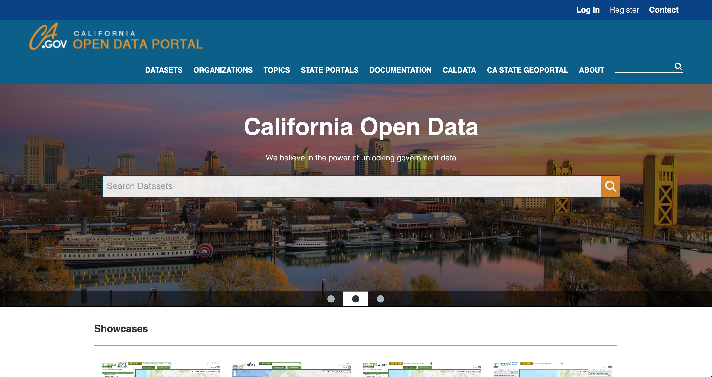

# open-fiscal-api
Accessing and using Open FI$Cal API data

This repository contains instructions for accessing  Open FI\$Cal data using the California Open Data Portal's API. It also contains open questions and ideas for projects using the Open FI\$Cal data.

The example code was written in R. To run the code in this repository, you need:

- [R](https://www.r-project.org/)
- [RStudio](https://rstudio.com/)
- The R packages included in the code

An older version of the example code, pointing to an earlier demo API site, is written in Python. (If you'd like to update this for us, check out [Issue #11](https://github.com/code4sac/open-fiscal-api/issues/11).) To run this code, you need:

- [Python](https://www.python.org/downloads/)
- [Jupyter Notebook](https://jupyter.org/install)
- The Python modules included in the code

## Where to find open questions and ideas

Check out the "Issues" tab in this repo. Answer questions, ask follow-up questions, and share your results in the issue comments!

## How to access the Open FI$Cal API

Two flavors of Open FI\$Cal data are available for download and API access at the California Open Data Portal. They include the [Spending Transactions](https://data.ca.gov/dataset/spending-transactions) and [Vendor Transactions](https://data.ca.gov/dataset/vendor-transactions) datasets. You can read the API documentation linked at the bottom of each page of the Open Data Portal.

For examples of how to use the API with R, open the "API_Examples.Rmd" or "API_Examples.md" file in this repository and follow the instructions there. The .Rmd file can be knit within RStudio to produce the .md version of the file, running all the code in the file in the process.

For examples of how to use the API with Python, open the "API_Examples_Python.ipynb" file. [Note this still points to the old demo API. See Issue #11.]

## Wait, what's Open FI$Cal exactly?

[Open FI$Cal](https://open.fiscal.ca.gov/) is a state website that allows you to see the majority of the State of California's expenditures at the individual transaction level. It contains expenditure data for over 150 state departments (though there are some departments that don't use FI\$Cal for their accounting, and so are not included in the data). The primary datasets included in Open FI\$Cal are:

* **Spending Transactions** - This includes every expenditure transaction for all of the departments that use FI\$Cal for their accounting, though with no vendor names attached.
* **Vendor Transactions** - This is a subset of the Spending Transactions dataset, with the names of vendors paid by the state.

We plan to continue to expand the data on Open FI\$Cal over time.

The site includes multiple ways to interact with the data. From least to most technical, they are:

1. [**Read descriptions of the data:**](https://open.fiscal.ca.gov/learning-center/) The Open FI$Cal Learning Center describes the data available on the site and includes basic accounting concepts to help you make sense of the data.
2. [**Use the interactive charts:**](https://fiscalca.opengov.com/transparency#/) The main body of the site contains interactive charts that let you drill down into and display the data you're interested in.
3. [**Download the data:**](https://open.fiscal.ca.gov/download-expenditures.html) Download the data to analyze it in bulk using your own preferred software or code.
4. **Use the API:** We've copied our data over to the state Open Data Portal to take advantage of the API capability already included in that site. You can use the CKAN API to connect directly to the [Spending Transactions](https://data.ca.gov/dataset/spending-transactions) and [Vendor Transactions](https://data.ca.gov/dataset/vendor-transactions) datasets.
