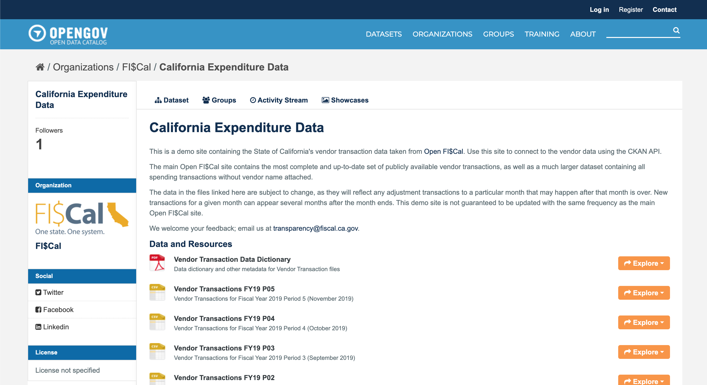
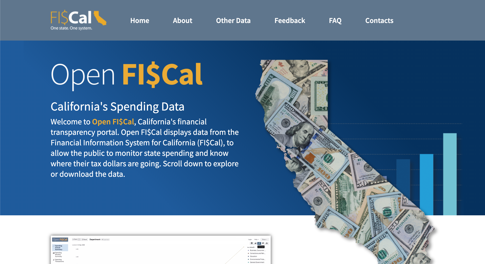

# open-fiscal-api
Accessing and using Open FI$Cal API data

This repository contains instructions for accessing the demo version of the Open FI\$Cal API, as well as open questions and ideas for projects using the Open FI\$Cal data.

The example code was written in R. To run the code in this repository, you need:

- The latest version of [R](https://www.r-project.org/)
- The latest version of [RStudio](https://rstudio.com/)
- The R packages included in the code

## Where to find open questions and ideas

Check out the "Issues" tab in this repo. Answer questions, ask follow-up questions, and share your results in the issue comments!

## How to access the Open FI$Cal API

[The demo version of the Open FI$Cal API is at this link.](https://catalog.ogopendata.com/dataset/california-expenditure-data) You can read the API documentation linked there.

For examples of how to use the API with R, open the "API_Examples.Rmd" or "API_Examples.md" file in this repository and follow the instructions there. The .Rmd file can be knit within RStudio to produce an HTML document that runs all of the embedded code and displays the results.

For examples of how to use the API with Python, open the "API_Examples_Python.ipynb" file.

## Wait, what's Open FI$Cal exactly?

[Open FI$Cal](https://open.fiscal.ca.gov/) is a state website that allows you to see the majority of the State of California's expenditures at the individual transaction level. It will continue to grow and expand over time.

The site includes multiple ways to interact with the data. From least to most technical, they are:

1. [**Read descriptions of the data:**](https://open.fiscal.ca.gov/learning-center/) The Open FI$Cal Learning Center includes basic terminology to help you understand the information you'll find on the site.
2. [**Use the interactive charts:**](https://fiscalca.opengov.com/transparency#/) The main body of the site contains interactive charts that let you drill down into and display the data you're interested in.
3. [**Download the data:**](https://open.fiscal.ca.gov/download-expenditures.html) Download the data to analyze it in bulk using your own preferred software or code.
4. [**Use the API:**](https://catalog.ogopendata.com/dataset/california-expenditure-data) The demo API is not yet on the official site, but lets you programatically pull in data to your own app or website. Currently, the demo API only connects to the vendor transactions file from the main site.
